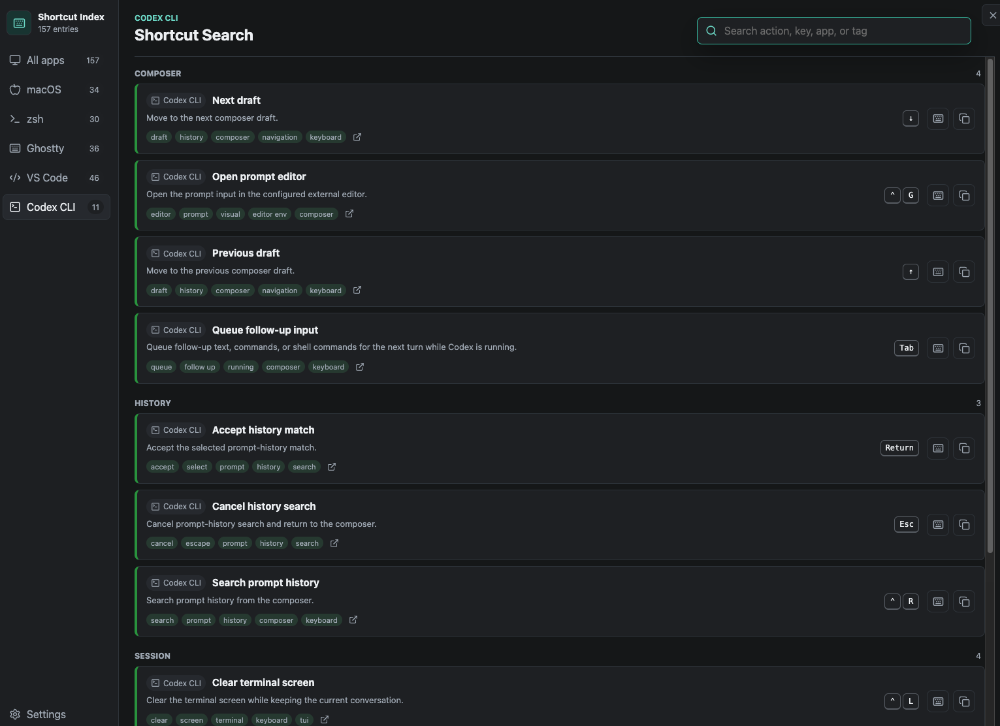
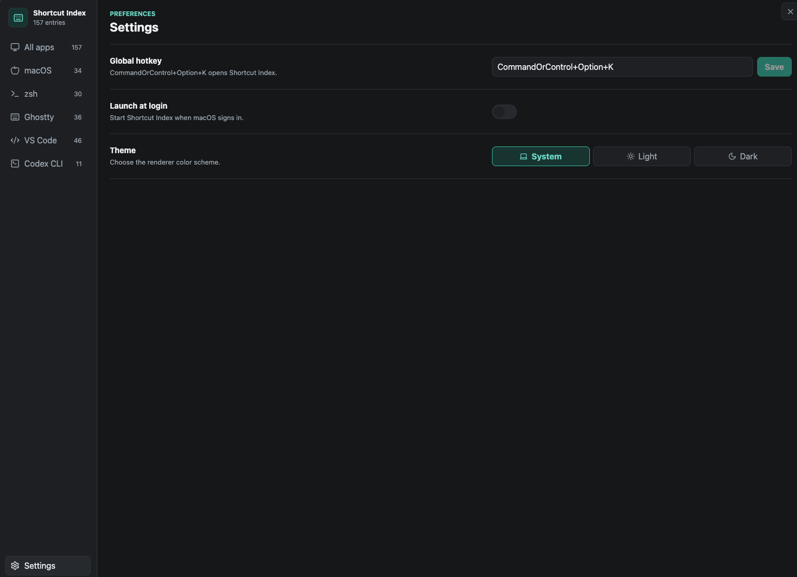

# Shortcut Index

An offline Electron menu-bar app for quickly searching shortcuts across macOS, zsh, Ghostty, VS Code, and Codex CLI.

## Usage

Use the sidebar to filter by app, then search by action, key, app name, or tag. Each shortcut card shows the action, keybinding, tags, a source link, and copy controls.



Open Settings to change the global hotkey, launch-at-login behavior, and theme preference.



## Run

```bash
npm install
npm run dev
```

## Verify

```bash
npm run lint
npm run typecheck
npm run build
npm run package
```

## Data Sources

- macOS keyboard shortcuts: https://support.apple.com/en-us/102650
- VS Code keybindings: https://code.visualstudio.com/docs/configure/keybindings
- Ghostty keybindings: https://ghostty.org/docs/config/keybind/reference
- zsh line editor: https://zsh.sourceforge.io/Doc/Release/Zsh-Line-Editor.html
- Codex CLI features: https://developers.openai.com/codex/cli/features

The app intentionally ships with curated local JSON data. It does not scrape application menus or require Accessibility permissions in v1.
